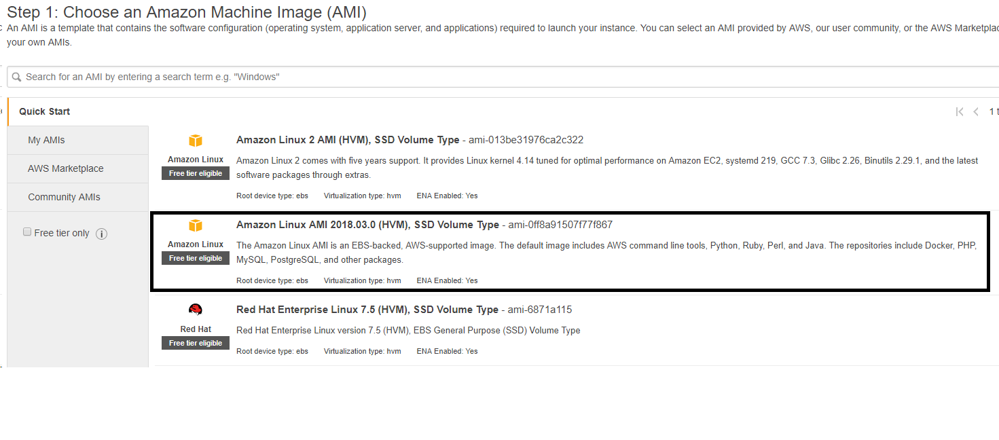
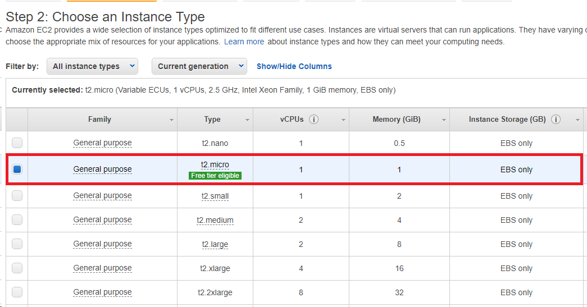
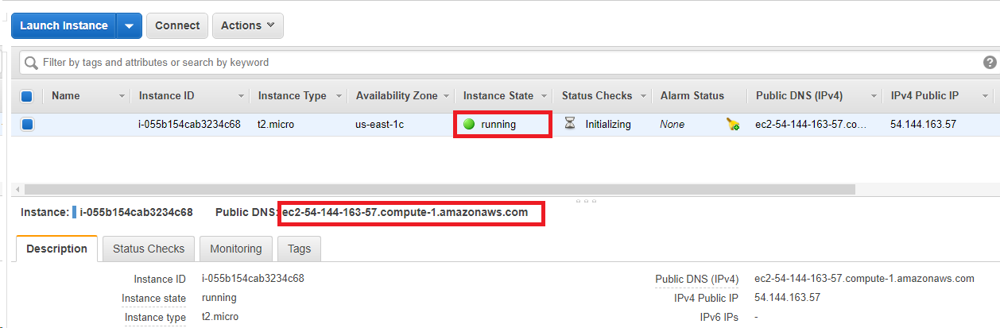
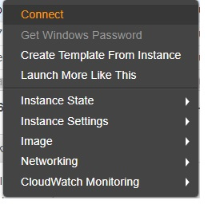
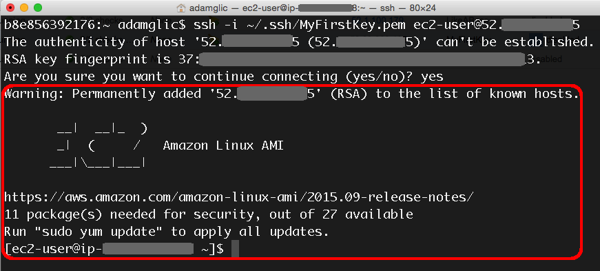
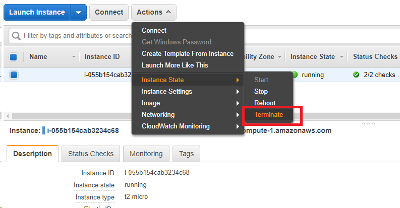

# Lab 12 - Create and Launch Amazon EC2 Instance

Amazon Elastic Compute Cloud (EC2) is the Amazon Web Service you use to create and run virtual machines in the cloud (we call these virtual machines 'instances'). This step-by-step guide will help you launch a Linux virtual machine on Amazon EC2 within our AWS Free Tier.

## Step 1: Launch an Amazon EC2 Instance

a. [Click here](https://console.aws.amazon.com/ec2/v2/home?region=us-east-1#) (or AWS console > Services > Compute > EC2 **and** set the region to **us-east-1 [N. Virginia]** ) to open the Amazon EC2 console. 

b. Click **Launch Instance** to create and configure your virtual machine.


## Step 2: Configure your Instance
You are now in the EC2 Launch Instance Wizard, which will help you configure and launch your instance.

a. With Amazon EC2, you can specify the software and specifications of the instance you want to use. In this screen, you are shown options to choose an Amazon Machine Image (AMI), which is a template that contains the software configuration (e.g. an operating system, an application server, and applications).  From an AMI, you launch an instance, which is a copy of the AMI running as a virtual server in the cloud.

For this tutorial, find *Amazon Linux AMI* and click **Select**.



***

b. You will now choose an instance type. Instance types comprise of varying combinations of CPU, memory, storage, and networking capacity so you can choose the appropriate mix for your applications. For more information, see [Amazon EC2 Instance Types](https://aws.amazon.com/ec2/instance-types/).


The default option of **t2.micro** should already be checked. This instance type is covered within the *Free Tier* and offers enough compute capacity to tackle simple workloads. Click **Review and Launch** at the bottom of the page.



***

c. You can review the configuration, storage, tagging, and security settings that have been selected for your instance. While you have the option to customize these settings, we recommend accepting the default values for this tutorial. 

Click **Launch** at the bottom of the page.

***

d. On the next screen you will be asked to choose an existing key pair or create a new key pair. A key pair is used to log into your instance (just like your house key is used to enter your home). Select **Create a new key pair** and give it the name **aws**. Next click the **Download Key Pair** button.

> **Note**: If you have already created key pair before, you can choose an existing pair.

Be sure to save the key pair in a safe location on your computer. If you don't remember where you store your SSH private key (the file you are downloading), you won't be able to connect to your virtual machine.

After you have stored your key pair, click **Launch Instance** to start your Linux instance.

> **Note**: It will take a few minutes to launch your instance.


***

e. Click **View Instances** on the next screen to view your instances and see the status of the instance you have just started.


***

f. Make note of the **Public IP** address of your AWS instance, you will need this to connect to the instance in Step 3 part c.

> **Note**: If your instance is still starting up, the Public IP address may not be shown yet. You can refresh these values by pressing the refresh button on the right just above the table.



## Step 3: Connect to your Instance

After launching your instance, it's time to connect to it.

***



a. Click the **Connect** button at the top of the page

copy the connection command in the form of `ssh -i your.pem user@server_address`

- **Windows users:**  Open a Git Bash window.
- **Mac/Linux users**: Open a Terminal window

***

b. In your bash shell,

first change the directory to where your store your private key file. 

Then type, for instance:

```bash
ssh -i /path/to/pem/file ec2-user@ec2-xxx.compute-1.amazonaws.com
```

> **Note**: You may need to first change the permission of the pem file. 

If you get a error matching "Permissions 0644 for '.../.ssh/aws.pem' are too open." Run the following to restrict the public access to this key pair file, and retry.

```bash
chmod 400 aws.pem
```

Or, in case you need elevated privilege,

```bash
sudo chmod 400 aws.pem
```

You'll see a response similar to the following:

```
The authenticity of host 'ec2-198-51-100-1.compute-1.amazonaws.com (10.254.142.33)' 
can't be established. RSA key fingerprint is 
1f:51:ae:28:df:63:e9:d8:cf:38:5d:87:2d:7b:b8:ca:9f:f5:b1:6f. 
Are you sure you want to continue connecting (yes/no)?
```

Type **yes** and press **enter**. 

You should then see the welcome screen for your instance and you are now connected to your AWS Linux virtual machine in the cloud.




***

c. view the instance information

If you want, you can type the following commands to see some information about this virtual machine instance.

```bash
# cpu type
lscpu
# memory status 
free 
# linux distribution and version
cat /etc/*release* 
```

## Step 4: Terminate Your Instance

You can easily terminate the instance from the EC2 console. In fact, **<span style='color:red'>it is a best practice to terminate instances you are no longer using so you don’t keep getting charged for them</span>**.

***

a. Back on the EC2 Console, select the box next to the instance you created.  Then click the **Actions** button, navigate to Instance State, and click **Terminate**.



- **Terminate**: The EBS volume will also be deleted; all the files you store on the instance will be lost
- **Stop**: The EBS volume will be there. You can restart the instance at the later date. The EBS storage will incur charges if you forget to delete it at a later time. 

***

b. You will be asked to confirm your termination - select **Yes, Terminate**.

> **Note**: This process can take several seconds to complete.  Once your instance has been terminated, the Instance State will change to terminated on your EC2 Console.

***

## Remarks

We do not use an EC2 directly for this course. But launching and connect to an EMR cluster has a similar process. 