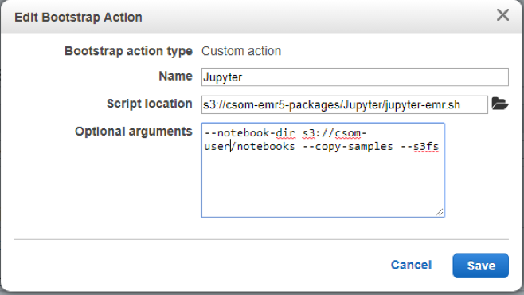

# How to Configure a Spark Cluster with Jupyter Notebook

**This instruction is about the Create Cluster stage only.** 

In this configuration, we use an exteral bootstrap script to create a cluster with Jupyter Notebook (for spark) installed:

1. At the top of the page **Create Cluster** page, you will see the ability to switch to **Go to advanced options**
2. At the **Software and Step** page, 
	1. Choose a release. Typically, the most recent release is the preferred option unless there is something you cannot explicitly do in a previous release.
	2. Choose the software you need installed. Usually you should go with default options. If your intent is to use spark only, you may want to check **Spark** and uncheck **Pig**, **Hive**, and **Sqoop**. The more you choose, it may take longer to start. 
	3. Click **Next**. 
3. Under the **Hardware configuration**:
    1. Choose **uniform instance groups**
    2. Choose the **default** network and **default** EC2 subnet.
    3. Leave the root devce DBS volume at its **default**
    	- If you're working on a fairly large data set, you'll need to add additional EBS storage according to project needs. 
    4. Leave the node instance types, counts, and purchase options at their default values. 
    	- If needed, node types can be changed and instance counts can be changed as well. However, if you're unsure what you need, it is best to leave the instances configured as they are. 
    5. Leave auto-scaling at their **default** options (disabled).
    	- If you do need auto-scaling (when you have bursts of computing demand), you may want to enable auto-scaling. To do so, you will need to determine which rules will be used to scale up and scale down. On **Core** nodes, you can add auto scaling rules, by clicking **Auto scaling** and adding your minimum and maximum node counts. 
	6. Once your hardware has been configured, click **Next**. 
4. At the **General Cluster Settings** page, 
	1. Give your cluster a descriptive **Cluster Name** if you want. 
	2. Take note of the S3 logging folder location so that you can retrieve logs if you experience errors.
	3. You may leave the debugging and termination production options at their **default**. 
	4. At the bottom, next to **Add bootstrap action,** select **Custom Action** from the drop down and click **Configure and add**
    	- A pop-up window will give you the option add a name to the action, i.e. `Jupyter Install`. 
    	- The script location is `s3://csom-emr5-packages/Jupyter/jupyter-emr.sh`
    	- In the arguments section, Type **`--notebook-dir s3:/<your bucket>/notebooks --copy-samples --s3fs`**
    	- Select `Add`

	5. Click `Next` to proceed to Security page.
5. At the **Security** page, 
	1.  Supply your **EC2 keypair** (e.g. aws.pem, which you have created earlier), so that you can use that key pair to SSH into the cluster.
	2.  Accep the **default** for the rest. 
	3.  Click on **Create cluster**. This step sometimes may take ~30 minutes depending on the software options that you choose. 

6. Once the Spark cluster state changes from "Starting" to "Waiting". 

