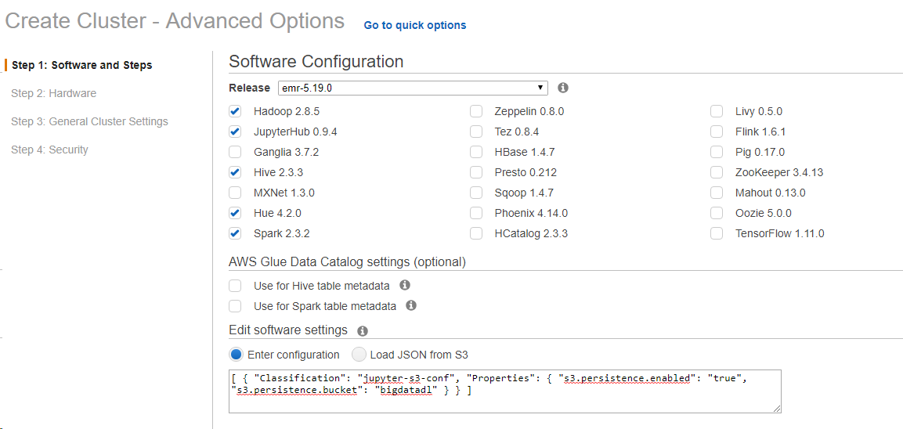
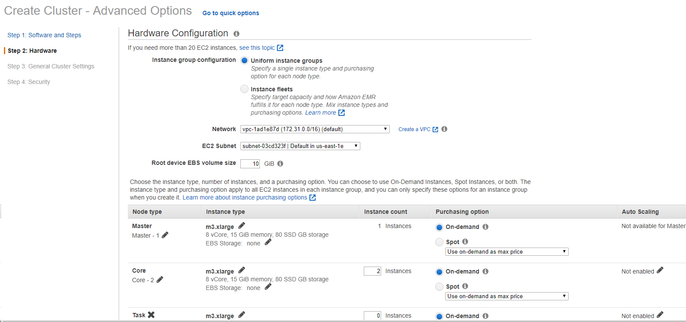
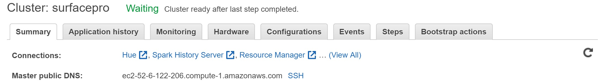

# Lab 13 - Using AWS EMR to Analyze Web Logs

You can do this lab on your own laptop without needing the cloudera VM or MSBA virtual desktop.

In this lab, we create and launch an EMR cluster, use it to create an external Hive table and run some Hive queries, then terminate the cluster.

This lab is based on the [AWS hands on document](http://docs.aws.amazon.com/ElasticMapReduce/latest/ManagementGuide/emr-gs.html). We have made some changes to reflect the recent updates to Amazon EMR and added more details. 

For more information about the EMR components such as Hue or JupyterHub, please refer to AWS EMR documentation 
at [https://docs.amazonaws.cn/en_us/emr/latest/ReleaseGuide/emr-release-components.html](https://docs.amazonaws.cn/en_us/emr/latest/ReleaseGuide/emr-release-components.html)

<!-- MarkdownTOC -->

- Prerequisites
- Step 1. Create an S3 bucket
- Step 2. Launch an EMR Cluster
- Step 3. Run Hive Queries
- Step 4: Try the Spark on Jupyter Hub
- Step 5. Terminate the EMR Cluster
- Links:
- Trouble Shooting: My Cluster Terminates Prematurely
- Appendix. Additional Exercises Using Hue

<!-- /MarkdownTOC -->

## Prerequisites

Before doing this lab, we assume that you have already completed *AWS lab 1 - Create and Launch AWS EC2 Instance*, where we have created and download a key pair, which we will reuse for this lab. If you have not created a key pair, you shoud create one when you're prompted to choose a key pair. 


## Step 1. Create an S3 bucket
In this tutorial, you use an Amazon S3 bucket to store your log files and output data. Because of Hadoop requirements, S3 bucket names used with Amazon EMR have the following constraints:

- Must contain only **lowercase letters**, numbers, periods (**.**), and hyphens **(-)**
- Cannot end in numbers

1. Create a bucket and accept other defaults. If you already have a bucket that meets these requirements, you may use it for this tutorial. For more information about creating buckets, go to [Create a Bucket](http://docs.aws.amazon.com/AmazonS3/latest/gsg/CreatingABucket.html) in the **Amazon Simple Storage Service Getting Started Guide**. 

2. In your S3 bucket, create the following folder: 
    - **cloudfront-logs-csv**: for a CSV based Hive table.

## Step 2. Launch an EMR Cluster

1. Navigate to AWS console and set the region to **us-east-1 (N. Virginia)** using the drop down menu right to your log in name. Alternatively, you can go to [https://us-east-1.console.aws.amazon.com/console/home?region=us-east-1](https://us-east-1.console.aws.amazon.com/console/home?region=us-east-1)
    > **Note**: to avoid issues, we will try to use us-east-1 (N. Virginia) for all our components so that they are located in the same region.

2. Choose **Services > Analytics > EMR** or go to: [https://us-east-1.console.aws.amazon.com/elasticmapreduce/home?region=us-east-1](https://us-east-1.console.aws.amazon.com/elasticmapreduce/home?region=us-east-1)

3. Click on **Create Cluster**

4. Choose **Advanced Options**

5. In **Step 1: Software and Steps**
    + Check **JupyterHub**, **Spark**
    + In the **Software settings** box, paste the following, then replace `MyJupyterBackups` with your S3 bucket name. 
        ```json
        [
            {
                "Classification": "jupyter-s3-conf",
                "Properties": {
                    "s3.persistence.enabled": "true",
                    "s3.persistence.bucket": "MyJupyterBackups"
                }
            }
        ]
        ```
    -  You should hover over all the **(i)** information icons for understanding what each option means. 

    
 
    > This Software Settings tells the JupyterHub to persist your notebooks in your S3 bucket. Otherwise, your notebook is saved on the master node of your cluster and when the cluster is terminated, the notebooks will be lost. For more details see [https://docs.amazonaws.cn/en_us/emr/latest/ReleaseGuide/emr-jupyterhub-s3.html](https://docs.amazonaws.cn/en_us/emr/latest/ReleaseGuide/emr-jupyterhub-s3.html)

6. In **Step 2: Hardware**
    - accept the default (which involves 1 m3.xlarge nodes and 2 m3.xlarge core nodes in my case). You can learn more about VM [instance types](https://aws.amazon.com/ec2/instance-types/) here.

    

7. Customize your cluster name in **Step 3** and accept the default for the rest. In **Step 4: Security**:
    - Choose an existing **EC2 Key pair** and select the one we have created in the first AWS lab. The default of not having an EC2 Key pair will prevent you from connecting to your cluster via SSH (but you can still connect to it via the HTTP ports).     
    - The rest you can accept defaults. 

8. Press **Create cluster**
    - You can check the status of EMR cluster from this screen or from EC2 Dashboard [here](https://console.aws.amazon.com/ec2/v2/home?region=us-east-1#Instances:sort=instanceId).

    > **Note** It might take up to 10 - 15 minutes for cluster to complete provisioning.

If your cluster terminates prematurely, please see [**Trouble Shooting**](#trouble-shooting-my-cluster-terminates-prematurely) at the end. 

9\. Wait for your EMR status to change. Once the master node is boot up, it will display a Public DNS for your master node. 

+ Go to the **Security groups for Master**, click the call out arrow.
+ In the new tab, making sure the master group is the one selected (it should be selected by default). Go to the "**inbound**" tab below, click **Edit**
+ Click "Add Rule" at the bottom, Choose **All traffic** for the first dropdown, and enter **0.0.0.0/0.** in text box after "Custom". Then Save


- When the cluster is **waiting**, you can click the refresh button on the top right, and you should be able to see **Connections**



**Important**: In the above, we take a shortcut of exposing your EMR cluster to everyone in the world. **This should never be done in a production environment.** In practice, you will need to create a secure connection between your EMR and the computer you use to connect to the EMR, but it takes several steps including establishing a SSH tunnel and install foxyproxy in your browser. Please follow the instructions provided in the "Enable Web Connections" to complete these steps. 


## Step 3. Run Hive Queries

You can access Hive through Hue. The connections are available through the "Hue" link at your EMR console (see Figure above).

1\.  Open Hue from your EMR console. Create your master user (e.g., `cloudera`) and password (e.g., `Cloudera1@`).

2\. We now create an external Hive table located in S3. You can copy paste this command (note the regex expression should be in one line).

```sql
CREATE TABLE cloudfront_logs(
    Date_time Date,
    Time String,
    Location String,
    Bytes Int,
    RequestIP String,
    Method String,
    Host String,
    Uri String,
    Status Int,
    Referrer String,
    Os String,
    Browser String,
    BrowserVersion string)
ROW FORMAT SERDE 'org.apache.hadoop.hive.serde2.RegexSerDe' 
WITH SERDEPROPERTIES ( "input.regex" = "^(?!#)([^ ]+)\\s+([^ ]+)\\s+([^ ]+)\\s+([^ ]+)\\s+([^ ]+)\\s+([^ ]+)\\s+([^ ]+)\\s+([^ ]+)\\s+([^ ]+)\\s+([^ ]+)\\s+[^\(]+[\(]([^\;]+).*\%20([^\/]+)[\/](.*)$") 
LOCATION 's3://us-east-1.elasticmapreduce.samples/cloudfront/data/';
```

3\.  Let's find the number of rows in the table:

```sql

```

4\. Now let's take a look at some of the records from the date '2014-07-05'

```sql
SELECT * FROM cloudfront_logs WHERE date_time = '2014-07-05' limit 20;
```

5\. Next, we try to export the previous query as a csv file. To do so, we first need to create a table with comma-delimited text format. 

```sql
CREATE EXTERNAL TABLE csvexport (
Date_time Date,
    Time String,
    Location String,
    Bytes Int,
    RequestIP String,
    Method String,
    Host String,
    Uri String,
    Status Int,
    Referrer String,
    Os String,
    Browser String,
    BrowserVersion string
  ) 
 row format delimited fields terminated by ',' 
 lines terminated by '\n' 
 STORED AS TEXTFILE
 LOCATION 's3://<your-bucket-name>/cloudfront-logs-csv';
```

**Important!: Like most Hadoop datasets, all files in the folder is treated as part of the dataset. So you must make sure each Hive table is in their separate directories.**

6\. Load the data (for '2014-07-05') into the external table from cloudfront_logs.

```sql

```

7\. Go to the S3 folder `cloudfront-logs-csv`, select the file (which may have the name of 0000xxx, then choose **Actions** > **Download as**, save it as a CSV file. 

8\. Verify the CSV file using Excel.

> **Note**: Hive internal tables will not be saved when cluster shuts down. If you want to save your results, copy the internal table data to some permanent storage, or create an external Hive table like what we did. 

## Step 4: Try the Spark on Jupyter Hub

1\. Click on the JupyterHub link at the EMR console, enter the user name `jovyan` and password `jupyter`. (**JupyterHub has the default user `jovyan` and password `jupyter`**).

2\. There are different kernels to choose from, including pyspark and pyspark3 (with python3), there is also a Spark (scala) kernel. Choose pyspark3. 

If you set up the jupyter notebook persistence, the notebooks you created here will be synced to your s3 folder (which you can check).


To test our the spark context and spark session variables (which should be automatically created), type: 

```
sc
```

and hit enter.

```
spark
```

3\. Your spark can issue HiveQL commands against your Hive data store. e.g.

```python
spark.sql("select * from cloudfront_logs limit 10").show()
```

**Note**: your notebook may comes with different default kernel. You can easily switch kernel using Jupyter Notebook's menu "Kernel > Change kernel" 

## Step 5. Terminate the EMR Cluster

<span style='color:red'>It is imperative that you terminate the cluster as soon as you done using it to avoid big bills</span> 

To terminate the cluster:

1. Open the Amazon EMR console.
2. Click on **Cluster List**
3. Select the cluster name, and then click **Terminate**. 
    + When the termination protection is on. the terminate button is disabled. You have to turn off the termination protection, then terminate it. 

**Checklist**

- **IMPORTANT!!  Your cluster has been terminated (go to the AWS EMR console and view cluster status)**
- To double check, you should also go to EC2 dash board to see if you have running instances (your EMR should generate 3 EC2 instances by default). Note that termination of the EMR cluster may take some time.
- check your account billing status: https://console.aws.amazon.com/billing/home?region=us-east-1#/ to avoid any surprises. 

## Links:

- Connect to EMR cluster: [https://docs.aws.amazon.com/emr/latest/ManagementGuide/emr-connect-master-node.html](https://docs.aws.amazon.com/emr/latest/ManagementGuide/emr-connect-master-node.html) 
- AWS's command line interface CLI: a powerful way to manage your AWS resources. [http://docs.aws.amazon.com/cli/latest/userguide/using-s3-commands.html](https://docs.aws.amazon.com/cli/#lang/en_us)
- Install additional Jupyter Kernels and libraries: [https://docs.aws.amazon.com/emr/latest/ReleaseGuide/emr-jupyterhub-install-kernels-libs.html](https://docs.aws.amazon.com/emr/latest/ReleaseGuide/emr-jupyterhub-install-kernels-libs.html)


## Trouble Shooting: My Cluster Terminates Prematurely

The first step of diagnosing a premature termination is to observe what the termination message was. It usually appears right next to the terminatation status. Based on the error message there, you can try to fix the issue.

You may clone the terminated EME cluster, which gives you a chance to examine the configuration of the EMR cluster.

Common cause to cluster premature termination include: 
1. The bootstrap stript has errors
2. The URL for the bootstrap script is incorrect - The file/location does not exist. Carefully examine the Script location in Step 3: General Cluster Setting, and content of the script, and fix any problem there. 
3. The Software Settings are incorrectly specified. Double check Step 1: Software Settings. Fix any errors there. 
4. The instance type does not exist. Sometimes you may accidentally specify an instance type that is not supported in the availability zone. We typically choose the default type.
5. The log foldder is incorrectly specified (or does not exist). 

If you still cannot identify or fix the error, you may inspect the [EMR log file](https://docs.aws.amazon.com/emr/latest/ManagementGuide/emr-troubleshoot-failed-4.html) to get some useful info about the nature of the error. 

## Appendix. Additional Exercises Using Hue

1\. What is the distribution of traffic (number of visits) per hour of day? (hint use **substring** function on the **time** field to get hours)

2\. What are the top 10 browsers used to access these websites?

3\. What are the top 3 request IPs by total number of visits? what are their total bytes transmitted? (you can answer the two questions in one query)
